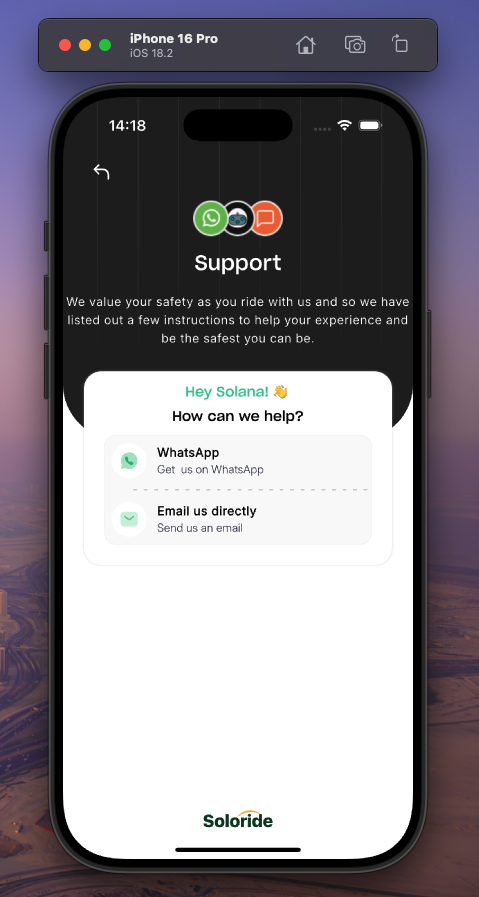

# Flutter-Developer-Portfolio

  

Hello and welcome! 👋🏾💜, I'm thrilled to have you here. This GitHub repository showcases my journey as a Flutter developer, featuring a curated collection of my projects, contributions, and learning experiences. As a Flutter Developer, having worked on projects varying from Fintechs 💵, Health⚕️, e-Commerce 🚚, AI 🤖, and Religion ✝️ etc, am currently seeking remote or relocation opportunities. Feel free to browse through my projects, check out the code, and see what I've been working on. If you have any questions, or suggestions, or just want to say hi, don't hesitate to reach out ☎️ 📞!

 

#

# 1. Soloride

<!--  -->

To revolutionize transportation in Nigeria by creating a ride-hailing platform that prioritizes affordability, safety, and community, while empowering drivers and providing seamless experiences for passengers.

## (Intro-Video)

https://github.com/user-attachments/assets/903c83b2-7155-464c-bdf7-7db3bbc19280

## Drive with Soloride: Earn more, stress less !!!

  <table>
    <tr>
      <td style="text-align: center">
        
      </td>
      <td style="text-align: center">
        
      </td>
      <td style="text-align: center">
        
      </td>
       <td style="text-align: center">
        
      </td>
    </tr> 
     <tr>
      <td style="text-align: center">
        
      </td>
      <td style="text-align: center">
        
      </td>
      <td style="text-align: center">
        
      </td>
       <td style="text-align: center">
        
      </td>
    </tr>   
  </table>

## Key Features

1.  Functional Google Map:

        - The map is designed to display polylines for showing routes between the rider's and driver's locations. This ensures that both the rider and driver can track the path clearly and navigate smoothly.

        - Dynamic Map Themes: The app offers dynamic themes that adjust the appearance of the map based on the app's state.

2.  Seamless Voice Calls:

        - The in-app calling system provides users with an uninterrupted experience while communicating. Whether it’s for confirming pick-up points or clarifying trip details, both riders and drivers can make calls effortlessly.

3.  Saved Routes:

        - Riders and drivers can save common destinations and this eliminates the need to manually input these addresses each time.

4.  Trip Histories :

        - The app offers the ability to view detailed trip histories, allowing riders and drivers to track past rides and review the trip details.

## Tools

- Flutter/Dart 💙
- Firebase (firestore, storage) 🔥
- Cloud Notifications 🌩️
- Shared Preferences 💾
- Calls (with Agora SDK) 🤙
- Google Maps (polylines, markers, real-time) 🗺️📍
- Riverpod for State Management 🚀
- Websocket 🔌
- Optimized for iOS and Android 📱  

#

# 2. GovDrive

Welcome to Gov Drive, where MDAs can safeguard all their important documents and files securely. Say goodbye to the worry of losing physical documents and enjoy the convenience of accessing your files from anywhere, anytime.

## (Intro-Video)

https://github.com/user-attachments/assets/f7d5ef43-9d92-447d-9ee1-a3fa5d1aca97

## Never Lose a File Again. Secure Your Documents with 1Gov Drive

  <table>
    <tr>
     <td style="text-align: center">
        
      </td>
      <td style="text-align: center">
        
      </td>
      <td style="text-align: center">
        
      </td>
       <td style="text-align: center">
        
      </td>
    </tr>  
  </table>

## Key Features

1.  View, Share, Copy, and Send Files:

        -The app offers robust functionality for managing files in different formats, allowing users to interact with them in several ways.

2.  Sign Documents:

        - The app includes a document signing feature that allows users to sign documents electronically.

3.  Universal Document Viewers:

        - Whether the user is dealing with PDFs, Word, Excel, PowerPoint, image files, or even more specialized formats, the app can open and display them properly. This feature ensures that users can handle a diverse array of documents without needing multiple apps

4.  Search Functionalities:

        - The search functionality in the app allows users to quickly find specific documents or content within folders.

## Tools

- Flutter/Dart 💙
- REST API 🌩️
- Shared Preferences 💾
- Document Viewer 📑
- Riverpod for State Management 🚀
- Optimized for iOS and Android 📱

#

# 3. Eye-Dr 

EYE-DR is a groundbreaking mobile application designed to enhance the screening and management of diabetic retinopathy (DR). Tailored for healthcare professionals and individuals with diabetes, EYE-DR leverages advanced technology to provide a seamless, efficient, and accurate solution for retinal imaging and DR detection.

## (Intro-Video)

https://github.com/user-attachments/assets/ffbe90d8-951f-40c9-a622-776e3f658a7b

## Eye-Dr: Screening and management of diabetic retinopathy (DR)

  <table>
    <tr>
      <td style="text-align: center">
        
      </td>
      <td style="text-align: center">
        
      </td>
      <td style="text-align: center">
        
      </td>
       <td style="text-align: center">
        
      </td>
      <td style="text-align: center">
        
      </td>
    </tr>   
  </table>

## Key Features

1.  Intuitive and user-friendly interface:

        - Easily enter patient details, capture images, and view results with our intuitive app.

        - Light and dark modes

2.  Portable Imaging:

        - Attach a portable ophthalmoscope to your smartphone for high-quality retinal images anytime, anywhere.

3.  AI-Powered Analysis:

        - Leverage our cutting-edge deep learning model for accurate DR detection and grading.

4.  Comprehensive Reports :

        - Get detailed diagnostic reports with actionable insights. Cross-Platform Availability: Available on both iOS and Android.

## Tools

- Flutter/Dart 💙
- Firebase (firestore, auth, storage) 🔥
- Shared Preferences 💾
- Lottie 🐠
- Localization (en & my) 🌎
- Tensorflow 🗂️
- Firebase Machine Learning ⚙️
- Riverpod for State Management 🚀
- Themes (Light🌕 and dark 🌒)
- Optimized for iOS and Android 📱

<!---------------------- KOCHURE   -------------------------->
 

#
# 4. AssetWize

This secure file management app focuses on protecting sensitive user information, such as insurance documents, land titles, jewelry receipts, and other valuable assets, by encrypting and storing them securely on the user's phone. Additionally, the app offers an optional backup feature to sync the files with the user’s cloud or drive for extra security and accessibility.

## (Intro-Video)

https://github.com/user-attachments/assets/44548d57-05be-4267-b905-693c2e276b72

## Encrypted and secured documents

  <table>
    <tr>
      <td style="text-align: center">
        
      </td>
      <td style="text-align: center">
        
      </td>
      <td style="text-align: center">
        
      </td>
       <td style="text-align: center">
        
      </td>
    </tr> 
    
  </table>

## Key Features

1.  Encrypted Document Storage:

        - All user documents, such as insurance policies, land deeds, jewelry receipts, and other critical assets, are encrypted using industry-standard encryption algorithms(AES-256). This ensures that sensitive information is protected from unauthorized access, even if the device is lost or compromised.

2.  Offline-Support:

        - Users can store and access their important documents directly on their phones, with everything kept within the app for ease of use even without the Internet-enabled on the device.

3.  Cloud Backup:

        - The app allows users to create encrypted backups of their documents in the cloud, ensuring that files are stored securely off-device.

        - Users can set automatic or manual backup intervals, giving them control over when and how their documents are backed up.

4.  Intuitive and user-friendly interface:

        - Users can create custom categories or folders (e.g., “Insurance,” “Land Titles,” “Jewelry Receipts”) to organize their documents based on asset type. This allows them to quickly find specific documents when needed.

## Tools

- Flutter/Dart 💙
- Firebase (Authentication) 🔥
- Cloud Backup (Google Drive & iCloud) 🌩️
- Shared Preferences 💾
- Encryption and Decryption 🔐
- PDF Previewer 📄
- PDF password removal 🔑
- Riverpod for State Management 🚀
- Optimized for iOS and Android 📱  

#

# 5. Kochure  

Easily convert your cryptocurrencies to cash in Nigeria at the lowest fees. Pay the lowest transaction fee of 1.99% on every transaction and begin your crypto journey with as little as N500.

## (Intro-Video)

https://github.com/user-attachments/assets/e85cf921-20df-4fb3-98a3-9e96f8987566

## Kochure: hold, buy, sell, save, receive cryptocurrencies

  <table>
    <tr>
      <td style="text-align: center">
        
      </td>
      <td style="text-align: center">
        
      </td>
      <td style="text-align: center">
        
      </td>
       <td style="text-align: center">
        
      </td>
      <td style="text-align: center">
        
      </td>
    </tr>
  </table>

## Key Features

1.  Intuitive and user-friendly interface:

        - Enjoy a sleek and intuitive user interface designed for seamless navigation and effortless interaction.

        - Light and dark modes

2.  Real-time candlestick chart;

        - Find your winning trade at a glance by analyzing the crypto market with your mobile device.

3.  Price alert notification:

        - Never miss a trade! Get an instant notification on your phone when the price of a crypto token or coin reaches a particular price you set.

4.  Multi-level Authentication:

        - The Kochure app is built with the latest blockchain security features with military-grade encryption, your crypto assets are safe and can only be assessed by you.

5.  Multi-coin feature:

        - Buy, sell, swap, and HODL over 40 coins and tokens on the Kochure app.

6.  Savings:

        - Unlock the power of this feature and watch your savings thrive with up to 12% interest. With options to top-up and withdraw at any time (Flexible)

## Tools:

- Themes (Light🌕 and dark 🌒)
- NodeJs (Login/Sign up, Reset Password, biometric)
- Binance API - Push Notification (Firebase Messaging🔥)
- QR-code generator and scan for wallet address and payment 攀
- Provider for State Management 🚀

#

# 6. Connect-Me  

<strong> Connect_Me is a user-friendly mobile application that empowers users to streamline their communication, networking, and information-sharing processes with the power of QR codes. Whether you're a professional seeking to exchange business details, a social media enthusiast connecting with new friends, or a tech-savvy individual looking for a convenient way to share information, Connect_Me is the ultimate solution for all your QR code needs. </strong>

 

## (Intro-Video)

https://github.com/Captured-Heart/connect_me/assets/69226443/63c2abe0-4c5f-4151-9f9a-77beb289a4b7

## Connect-Me: QR code Digital ID

  <table>
    <tr>
      <td style="text-align: center">
        
      </td>
      <td style="text-align: center">
        
      </td>
       <td style="text-align: center">
        
      </td>
      <td style="text-align: center">
        
      </td>
       <td style="text-align: center">
        
      </td>
    </tr>
    <tr>
       <td style="text-align: center">
        
      </td>
      <td style="text-align: center">
        
      </td>
      <td style="text-align: center">
        
      </td>
      <td style="text-align: center">
        
      </td>
       <td style="text-align: center">
        
      </td>
    </tr> 
  </table>

## Key Features

1.  QR Code Generator:

         - Easily create custom QR codes for various purposes such as sharing contact details, website URLs, social media profiles, work experience, and more.

2.  QR Code Scanner:

         - Seamlessly scan QR codes using your device's camera and also via QR code images

3.  Personal Information Profile:

        - Create, update, and save your personal information profile within the app, including contact details, social media links, bio, and profile picture.

        - Attach your personal information profile to a custom QR code, allowing you to share comprehensive details with others in a single scan.

4.  Add Users via QR Codes:

          - Easily add new contacts to your network or exchange information with colleagues, friends, or business partners by scanning their QR codes.

5.  User-Friendly Interface:

         - Enjoy a sleek and intuitive user interface designed for seamless navigation and effortless interaction.

         - Light and dark modes

<!---------------------- HOMETOWN   -------------------------->
 

#

# 7. Hometown  

Hometown is not just an app; it's your passport to financial bliss. Embrace banking freedom. Manage your finances from the comfort of your home, office, or while you're on the move - 24/7 accessibility guaranteed.

## (Intro-Video)

https://github.com/user-attachments/assets/4e570419-3292-40a0-b6a7-a01e754ff043

## Hometown: The Ultimate Banking Experience

  <table>
    <tr>
      <td style="text-align: center">
        
      </td>
      <td style="text-align: center">
        
      </td>
      <td style="text-align: center">
        
      </td>
       <td style="text-align: center">
        
      </td>
      <td style="text-align: center">
        
      </td>
    </tr>
  </table>

## Application Features:

1.  Transactions Made Simple:

        - Sending and receiving money has never been easier. With Hometown, transfer funds to any Nigerian account effortlessly, and witness the magic of swift transactions.

2.  Pay with Ease:

        - Why wait another minute? Settle essential services like DSTV, GoTV, Startimes, Showmax, PHCN subscriptions, and more in seconds right from the Hometown app.

3.  Grow Your Savings:

        - Unlock the power of the Akawo feature and watch your savings thrive with up to 12% interest. You can sleep soundly knowing your money is working tirelessly to secure your future.

4.  Get Instant Loans:

        - You are not alone. Let's help you ease the financial burdens. Get asses to the lowest-interest loans at the click of a button.

5.  Book Your Next Flight

        - Flying to any destination now begins from home. Book your next local or international flight easily and at the best price with the Hometown.

#

<h1 align="center"> ANIMATIONS</h1>

    

        

            <!-- Left content here -->
          <h2>Moniepoint Assessment   
   </h2> 
    <h4> AN INTRO VIDEO OF THE APP </h4>
  
  https://github.com/Captured-Heart/moniepoint_assessment_marcel/assets/69226443/d33b1af3-3300-4695-bb76-5b8aa1fd36f8

## UI Shots

  <table>
    <tr>
      <td style="text-align: center">
        
      </td>
      <td style="text-align: center">
        
      </td>
    </tr>
  </table>

## Tools

- [google_maps_flutter](https://pub.dev/packages/google_sign_in): A Flutter plugin that provides a Google Maps widget.
- [SVG_Repo](https://www.svgrepo.com/vectors/shield/): Free Shield SVG Vectors and Icons. Shield icons and vector packs for Sketch, Figma, websites, or apps. Browse 50 vector icons about the Shield term.
- [animated_flip_counter](https://pub.dev/packages/animated_flip_counter): An implicit animation widget that flips from one number to another.
- [auto_size_text](https://pub.dev/packages/auto_size_text): Flutter widget that automatically resizes text to fit perfectly within its bounds.
- [flutter_animate](https://pub.dev/packages/flutter_animate): A performant library that makes it simple to add almost any kind of animated effect in Flutter.
- [flutter_svg](https://pub.dev/packages/flutter_svg): Draw SVG files using Flutter.

<!-- Right content here -->
<h2>Animated Button 
 </h2>
    <h4> AN INTRO VIDEO OF THE APP </h4>
      
  https://github.com/Captured-Heart/animated_button_progress/assets/69226443/cea90a04-4a75-45cb-9db7-f15eb54e0408

## UI Shots

  <table>
    <tr>
      <td style="text-align: center">
        
      </td>
      <td style="text-align: center">
        
      </td>
    </tr>
  </table>

## Tools

- [gusto_neumorphic](https://pub.dev/packages/gusto_neumorphic): A complete, ready to use, Neumorphic ui kit for Flutter.
- [auto_size_text](https://pub.dev/packages/auto_size_text): Flutter widget that automatically resizes text to fit perfectly within its bounds.

